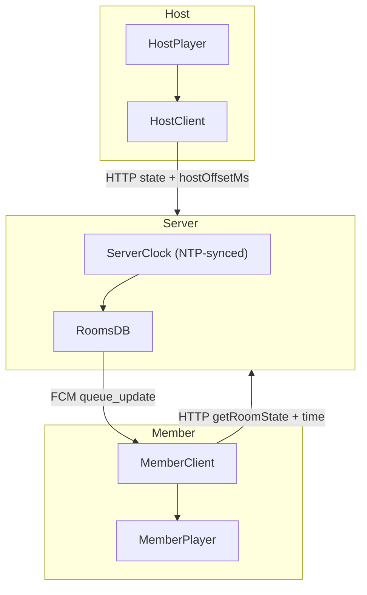

## Listen-along NTP offset + push-only sync

### 1. Clarify current behavior and constraints

- **Current timing model** (from `[frontend/src/stores/listenAlongStore.ts](frontend/src/stores/listenAlongStore.ts)`):
  - Host stamps `playStartedAt` and `updatedAt` using its local `Date.now()` when creating/updating room state:

```175:192:frontend/src/stores/listenAlongStore.ts
    const currentTime = audioEngine.getCurrentTime();
    const capturedAt = Date.now();
    const initialState: RoomSyncState = {
        ...,
        playStartedAt: capturedAt - currentTime * 1000,
        updatedAt: capturedAt,
    };


```

- Members derive target playback time using local receipt time and estimated one-way latency:

```151:160:frontend/src/stores/listenAlongStore.ts
    function getTargetPlaybackTimeSec(remoteState: RoomSyncState, timing: RemoteApplyTiming): number {
        const positionAtUpdateSec = getPositionAtStateUpdateSec(remoteState);
        if (!remoteState.isPlaying) return positionAtUpdateSec;
        const elapsedSinceReceiptMs = Math.max(0, Date.now() - timing.receivedAtMs);
        const oneWayLatencyMs = estimateOneWayLatencyMs(timing.networkRttMs);
        return Math.max(0, positionAtUpdateSec + (elapsedSinceReceiptMs + oneWayLatencyMs) / 1000);
    }


```

- **Current transport**: state updates go host → backend via HTTP; backend → members via FCM `queue_update` events plus **polling loop** + ACK heartbeat.
  - Member poll loop (must be removed):

```708:761:frontend/src/stores/listenAlongStore.ts
    function startMemberPollLoop(): void {
        ...
        memberPollIntervalId = setInterval(async () => {
            const roomInfo = await api.getRoomState(state.roomCode);
            ...
        }, LISTEN_ALONG.PRESENCE_POLL_INTERVAL);
    }


```

- ACK heartbeat loop (must be removed):

```821:839:frontend/src/stores/listenAlongStore.ts
    function startAckLoop(): void {
        ackIntervalId = setInterval(async () => {
            await api.ackRoomEvent(state.roomCode, state.peerId);
        }, 25_000);
    }


```

- **Backend** `[backend/v1-rooms.js](backend/v1-rooms.js)` already treats `Date.now()` as server time (assumed NTP-synced) via `now()` helper.

### 2. Design NTP-style time model using server clock + stored host offset

- **Assumptions**:
  - Server OS clock is NTP-synced and treated as the global reference clock.
  - We are allowed to make a _short burst_ of 4–5 HTTP calls during join/creation to measure latency (this is **not** continuous polling/heartbeat).
  - All continuous `setInterval`-based member polling and ACK heartbeats must be removed.
- **New time primitives**:
  - Add a backend endpoint, e.g. `GET /api/v1/time` (or `GET /api/v1/rooms/:code/time`) that returns `{ serverTimeMs: number }` using `now()`.
  - On the frontend, add a helper (e.g. in `listenAlongStore` or a small util) `measureServerOffset(samples = 5)` that:
    - For `i` in `1..samples`:
      - Records local `t0 = performance.now()` (or `Date.now()` fallback).
      - Calls the time endpoint.
      - On response, records local `t1`.
      - Computes `rtt_i = t1 - t0` and `clientMid_i = t0 + rtt_i / 2`.
      - Computes **clock offset sample** `offset_i = serverTimeMs - clientMid_i`.
    - Returns `{ avgOffsetMs, avgRttMs }` as the averages over 4–5 samples.
- **Host offset storage on backend**:
  - Extend `rooms` table with a nullable `host_offset_ms INTEGER` column.
  - On room creation (`POST /api/v1/rooms` in `v1-rooms.js`):
    - Accept `hostOffsetMs` in the request body alongside `initialState`.
    - Store `host_offset_ms = hostOffsetMs` for that room.
  - Optionally include `hostOffsetMs` in the room `state_json` for debugging, but core source of truth is the column.
- **Member offset usage**:
  - When a member joins a room:
    - First (or immediately after join) run `measureServerOffset(4–5)` to get `{ memberOffsetMs, avgRttMs }`.
    - Store these values in the listen-along store (e.g. `_clock: { offsetMs, avgRttMs }`).
  - Backend `GET /:code` and `POST /:code/join` responses should include `hostOffsetMs` from DB.
  - Members then always approximate server time as `serverNow ≈ clientNow + memberOffsetMs` and **host wall-clock** as `hostNow ≈ serverNow + hostOffsetMs`.

### 3. New playback math using offsets (no drift from wall-clock skew)

- **Host state semantics** (unchanged on wire):
  - `playStartedAt` and `updatedAt` remain in **host local wall-clock** units (ms since epoch from host `Date.now()`), as today.
- **On member, when applying remote state**:
  - Compute host position using only offsets and host timestamps (no ad-hoc RTT logic):
    - Let `clientNow = Date.now()`.
    - Approximate `serverNow = clientNow + memberOffsetMs`.
    - Approximate `hostNow = serverNow + hostOffsetMs`.
    - Compute `positionAtNowSec = max(0, (hostNow - remoteState.playStartedAt) / 1000)` if `remoteState.isPlaying`, else `positionAtUpdateSec`:
      - `positionAtUpdateSec = max(0, (remoteState.updatedAt - remoteState.playStartedAt) / 1000)`.
  - Implement a helper like `getTargetPlaybackTimeFromOffsets(remoteState, hostOffsetMs, memberOffsetMs)` and use it instead of `getTargetPlaybackTimeSec` when offsets are available.
- **Decode/buffer-aware seek**:
  - For **new song** (`songChanged` branch), keep the current pattern but replace RTT-based `getTargetPlaybackTimeSec` with the offset-based version and explicit averaged latency:
    - Before `loadAndPlay`, compute and store `applyStartedAtClient = Date.now()`.
    - After `waitForReady` / 5s max, recompute `clientNow2 = Date.now()` and `serverNow2 = clientNow2 + memberOffsetMs`, `hostNow2 = serverNow2 + hostOffsetMs`.
    - Compute final target `finalSeekSec = max(0, (hostNow2 - remoteState.playStartedAt) / 1000)`.
    - Seek to `finalSeekSec`, then `play`/`pause` to match host.
  - For **same song** (drift correction branch), periodically compute `hostNow` via offsets and adjust if `|currentTime - targetTime| > DRIFT_THRESHOLD` as today, but with offset-based `targetTime`.

### 4. Averaged latency for buffer/decode handling (4–5 samples)

- **Latency measurement strategy** (obeying “no heartbeat/polling anywhere”):
  - Use `measureServerOffset(4–5)` **only at these events**:
    - When host creates a room or restores host session.
    - When a member joins a room or performs an explicit reconnect after being offline.
  - Do **not** run it on a repeating interval; it is a short, bounded burst.
- **Usage in playback**:
  - Persist `avgRttMs` from `measureServerOffset` alongside `memberOffsetMs` in store.
  - If offsets are available, use them for all time math; use `avgRttMs` only for logs / optional one-way-latency sanity checks.
  - If offsets are _not_ yet measured (e.g. legacy sessions), fall back to the existing `getTargetPlaybackTimeSec` to remain robust.

### 5. Remove polling and heartbeat while keeping FCM-driven flow

- **Eliminate member polling loop**:
  - Remove all calls to `startMemberPollLoop()`:

```268:272:frontend/src/stores/listenAlongStore.ts
    await bootstrapFcmPresence();
    // Start polling for state updates
    startMemberPollLoop();


```

- Delete or no-op `startMemberPollLoop` / `stopMemberPollLoop` and their `setInterval` usage; rely solely on FCM-triggered fetches in `_handleFcmEvent`.
- Adjust `reconnect` and visibility / network handlers so that members perform at most **single-shot** `getRoomState` calls and offset recalculation (no recurring loops).
- **Eliminate ACK heartbeat loop**:
  - In `bootstrapFcmPresence`, stop calling `startAckLoop()` and delete its `setInterval` logic.
  - Presence (`is_online`) on the backend becomes event-driven:
    - `POST /:code/ack` is called:
      - On initial presence bootstrap.
      - Whenever a client handles an FCM event and calls `ackRoomEvent` (already done in `_handleFcmEvent`).
    - Backend continues to mark offline peers via `ACK_ONLINE_TTL_MS`, but the only ACKs come from real events and rare explicit presence pings (not a periodic heartbeat loop).

### 6. Backend API changes to surface offsets

- **Room creation (`POST /:code`)**:
  - Accept `hostOffsetMs` from the host and store it in `rooms.host_offset_ms`.
  - Include `hostOffsetMs` in the JSON response for convenience if needed.
- **Join room (`POST /:code/join`)**:
  - After looking up the room, include `hostOffsetMs: room.host_offset_ms || 0` in the response so the joining member can compute host wall-clock.
- **Get room (`GET /:code`)**:
  - Similarly, include `hostOffsetMs` in the response payload.
- **Optional**: add `GET /time` returning `{ serverTimeMs: now() }` if we want a generic, room-agnostic time endpoint; or reuse an existing room endpoint with minimal overhead.

### 7. Smooth host controls & queue operations using push-only model

- **Host actions** (seek/play/pause/song addition):
  - Continue to detect meaningful changes via `startHostSyncListener` and call `pushState()` debounced (no change needed here).
  - Backend continues to fan out `queue_update` events via FCM; members always recompute playback using offsets when these arrive.
- **Member flow**:
  - On `queue_update` FCM event, `_handleFcmEvent` already does a one-shot `getRoomState` and `_applyRemoteState`; we keep this pattern but swap in offset-based time math.
  - For join and reconnect, apply the same `_applyRemoteState` path with offsets, ensuring consistent handling of seek/play/pause and queue changes.

### 8. High-level data flow (NTP-style timing)



- **Key invariant**: all playback decisions on members are derived from `serverClock` plus stored offsets (`hostOffsetMs`, `memberOffsetMs`), never from raw local `Date.now()` alone.
- **No heartbeats or polling** remain: all multi-client sync is event- or action-driven, with only bounded, small bursts of HTTP requests to measure offsets/latency at join/creation/reconnect.
